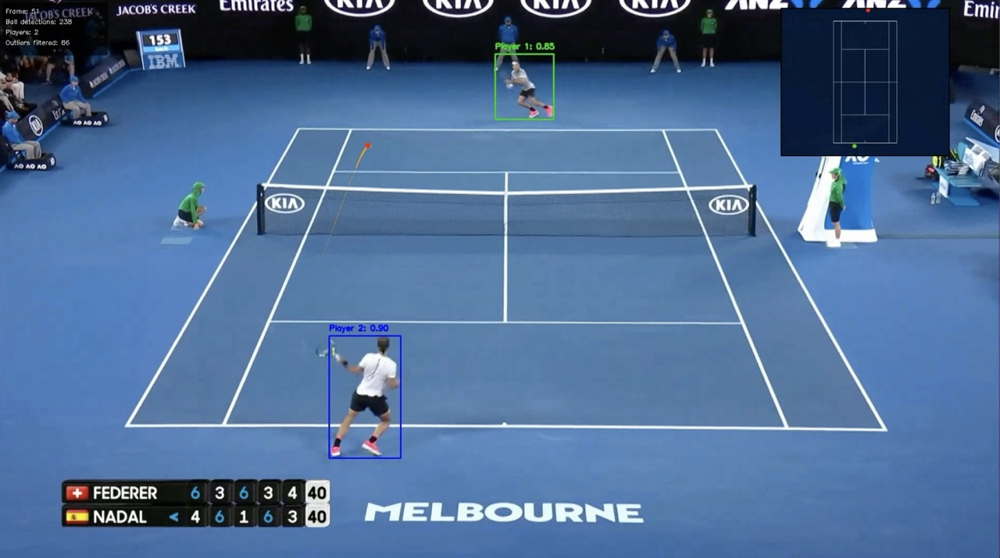

# Tennis Match Analysis Framework

A comprehensive Python framework for analyzing tennis matches using computer vision and deep learning. This project automates the process of downloading tennis match videos, segmenting them into individual points, and tracking both the ball and players throughout each point.



## 🎾 Features

- **Video Download**: Automated download of tennis match videos with support for segment selection
- **Point Segmentation**: Intelligent segmentation of tennis matches into individual points
- **Ball Tracking**: Advanced ball tracking using YOLO with trajectory prediction
- **Player Tracking**: Dual-player tracking with identification
- **Edge Detection and Homography**: Robust handling of occlusions and court perspective to create a mini-map
- **Analysis & Visualization**: Comprehensive visual output with player positions and ball trajectories
- **Modular Design**: Easy to extend and customize for specific needs

## 🛠 Technologies Used

- Python 3.10+
- PyTorch & YOLO for object detection
- OpenCV for video processing
- yt-dlp for video downloading
- FFmpeg for video manipulation
- NumPy, Pandas for data processing
- Matplotlib, Seaborn for visualization

## 📦 Installation

1. **Clone the repository**:
```bash
git clone https://github.com/yourusername/tennis-analysis.git
cd tennis-analysis
```

2. **Create and activate a virtual environment**:
```bash
# Create virtual environment
python3.10 -m venv venv

# Activate it
# On Unix/MacOS:
source venv/bin/activate
# On Windows:
.\venv\Scripts\activate
```

3. **Install other dependencies**:
```bash
pip install -r requirements.txt
```

4. **Install FFmpeg** (required for video processing):
```bash
# On MacOS
brew install ffmpeg

# On Ubuntu/Debian
sudo apt-get install ffmpeg
```

## 🚀 Usage

### Basic Usage

1. **Use the test suite**: *Recommended way to test that it works*
```bash
python test.py
```

1. **Process a complete match**:
```bash
python examples/complete_pipeline.py \
    "https://youtube.com/watch?v=your_match" \
    "output_directory" \
    --model-players "models/players/best.pt" \
    --model-ball "models/ball/best.pt" \
    --device "cuda"  # or "mps" for Mac M1/M2, "cpu" for CPU
```

1. **Process a specific segment**:
```bash
python examples/complete_pipeline.py \
    "https://youtube.com/watch?v=your_match" \
    "output_directory" \
    --model-players "models/players/best.pt" \
    --model-ball "models/ball/best.pt" \
    --start-time "01:30:00" \
    --duration "00:05:00"
```

### Python API

```python
from tennis_analysis import process_complete

summary = process_complete(
    video_url="https://youtube.com/watch?v=your_match",
    output_dir="output",
    model_players_path="models/players/best.pt",
    model_ball_path="models/ball/best.pt",
    device="cuda",
    start_time="01:30:00",  # optional
    duration="00:05:00"     # optional
)
```

## 📁 Project Structure

```
tennis_analysis/
├── src/
│   └── tennis_analysis/
│       ├── downloader/      # Video downloading
│       ├── preprocessor/    # Point segmentation
│       ├── tracking/        # Ball and player tracking
│       ├── tracking_display/    # Visualization of the tracked ball and players
│       ├── projector/    # Edge detection and homography for mini-map
│       └── postprocessing/  # Visualization
├── models/                  # Pre-trained YOLOv11 models
└── examples/               # Usage examples
```

## 🔧 Pipeline Steps

1. **Download**: Downloads the tennis match video, optionally selecting a specific segment
2. **Preprocessing**: 
   - Segments the video into individual points
   - Detects scene changes
   - Validates point durations and characteristics
3. **Tracking**:
   - Tracks the ball using YOLO with trajectory prediction
   - Tracks and identifies players
   - Handles occlusions and missed detections
4. **Tracking Display**:
   - Visualizes the tracked ball and players
   - Generates player and ball trajectories
5. **Projection**:
   - Detects court edges and homography
   - Creates a mini-map of the court
6. **Postprocessing**:
   - Generates visualization overlays
   - Creates analysis summaries
   - Exports processed videos

## 📈 Performance Considerations

- GPU recommended for real-time processing
- CPU-only processing is significantly slower
- Mac M1/M2 users should use MPS device for acceleration
- Memory usage scales with video resolution

## 🤝 Contributing

Contributions are welcome! Please feel free to submit a Pull Request. For major changes, please open an issue first to discuss what you would like to change.

## 👥 Authors

- **Alfonso Mateos Vicentee** ([@alffonsomv](https://github.com/AlffonsoMV)) – École Polytechnique Student
- **Emiliano Pizaña Vela** ([@emipizana](https://github.com/emipizana)) – École Polytechnique Student

## 🙏 Acknowledgments

- YOLO model architecture for object detection
- Tennis match datasets used for training (Roboflow)

